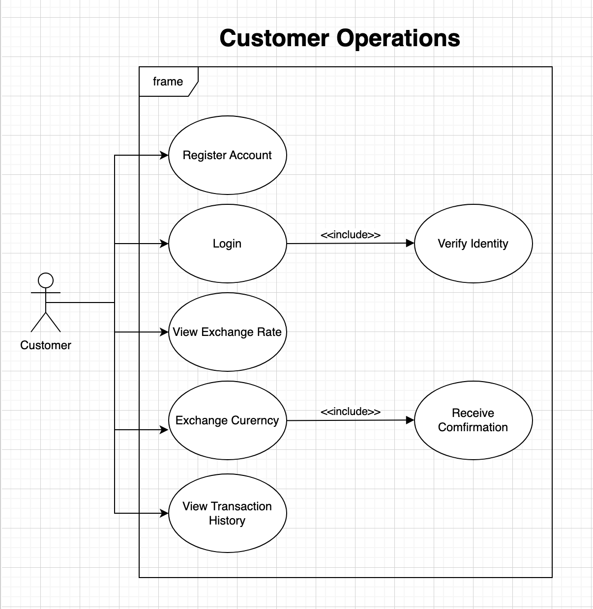
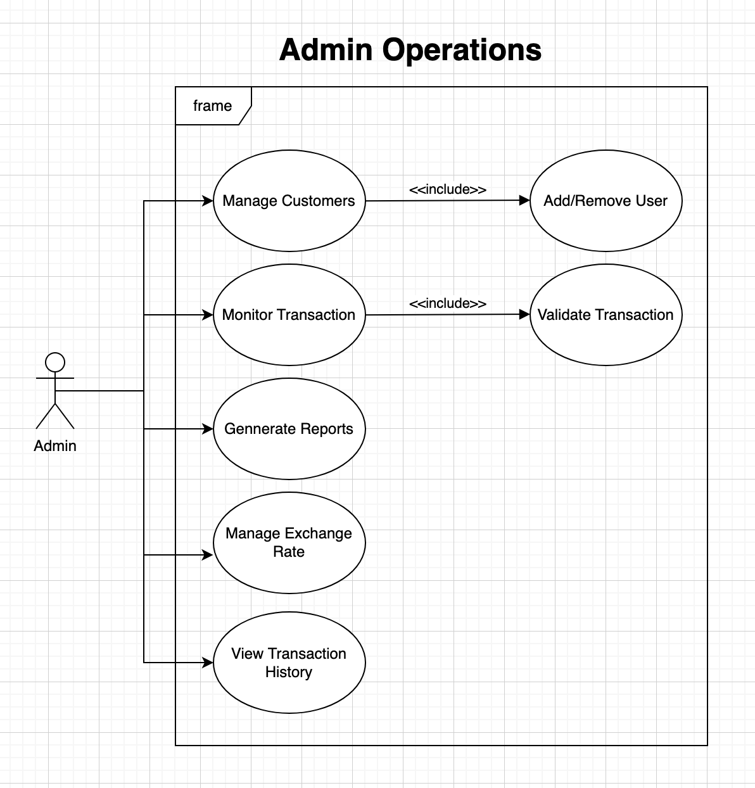

## Customer Use Case Diagram

This diagram shows end-user interactions with the system to perform currency exchange, such as register account, login, exchange currency, view transaction history.

## Admin Use Case Diagram

This diagram focuses on the Admin role, responsible for maintaining and controlling the system. Including: manage users, mointor transactions, update exchagne rates, and generate reports.