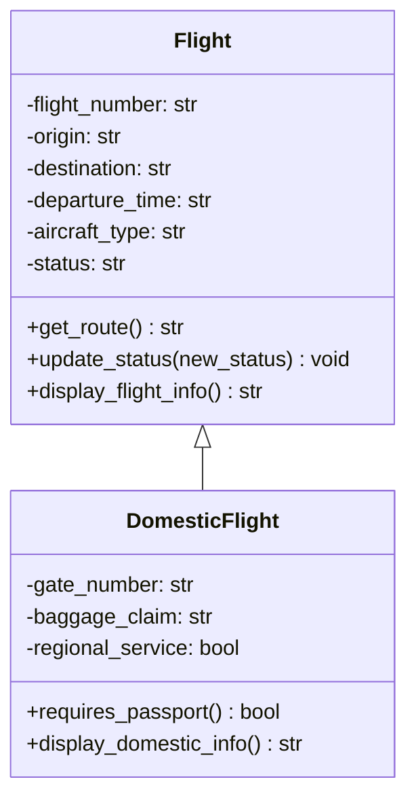

# Air New Zealand Domestic Flight Inheritance System

This project demonstrates single inheritance using a simple Air New Zealand flight system.

`Flight` is the parent class. It stores common flight attributes and provides shared methods that all flight types can use.

`DomesticFlight` is the subclass. It inherits the shared attributes and methods from `Flight`, then adds information that is specific to New Zealand domestic flights.

## Class Diagram



## Inheritance Relationship

- `DomesticFlight` inherits shared attributes from `Flight`, including `flight_number`, `origin`, `destination`, `departure_time`, `aircraft_type`, and `status`.
- `DomesticFlight` inherits shared methods from `Flight`, including `get_route()`, `update_status()`, and `display_flight_info()`.
- `DomesticFlight` adds domestic-specific attributes: `gate_number`, `baggage_claim`, and `regional_service`.
- `DomesticFlight` adds domestic-specific methods: `requires_passport()` and `display_domestic_info()`.

## Project Files

- `flight.py`: Contains the parent `Flight` class and child `DomesticFlight` class.
- `main.py`: Runs the demonstration program.
- `README.md`: Explains the project and includes the class diagram.

## How to Run

From this folder, run:

```bash
python3 main.py
```

## Example Output

```text
Air New Zealand Flight Inheritance Demonstration
====================================================

General Flight
----------------------------------------------------
Flight Number: NZ900
Route: Auckland to Sydney
Departure Time: 08:30
Aircraft Type: Boeing 787-9
Status: Scheduled

Domestic Flight
----------------------------------------------------
Flight Number: NZ423
Route: Auckland to Wellington
Departure Time: 10:15
Aircraft Type: Airbus A320neo
Status: Boarding
Gate Number: Gate 32
Baggage Claim: Belt 4
Service Type: Main domestic service
Travel Document: No passport required

Inherited Method Example
----------------------------------------------------
Domestic route using inherited get_route(): Auckland to Wellington
```
