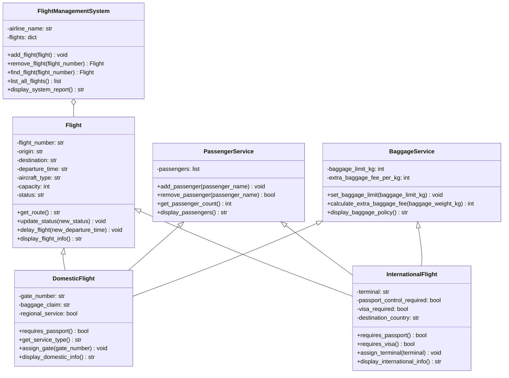

# Air New Zealand Management System with Hybrid Inheritance

This project is a flight management system that supports both domestic and international flights.

The design demonstrates **hybrid inheritance** by combining:

- **Hierarchical inheritance**: `DomesticFlight` and `InternationalFlight` both inherit from `Flight`.
- **Multiple inheritance**: `DomesticFlight` and `InternationalFlight` also inherit shared behaviour from `PassengerService` and `BaggageService`.

This means each flight type receives common flight attributes, passenger methods, and baggage methods from parent classes, then adds its own domestic or international details.

## Class Diagram



## Inheritance Relationship

`Flight` stores the shared flight attributes and methods used by every flight type:

- Shared attributes: `flight_number`, `origin`, `destination`, `departure_time`, `aircraft_type`, `capacity`, and `status`.
- Shared methods: `get_route()`, `update_status()`, `delay_flight()`, and `display_flight_info()`.

`PassengerService` stores passenger handling behaviour shared by both domestic and international flights:

- Shared attribute: `passengers`.
- Shared methods: `add_passenger()`, `remove_passenger()`, `get_passenger_count()`, and `display_passengers()`.

`BaggageService` stores baggage handling behaviour shared by both domestic and international flights:

- Shared attributes: `baggage_limit_kg` and `extra_baggage_fee_per_kg`.
- Shared methods: `set_baggage_limit()`, `calculate_extra_baggage_fee()`, and `display_baggage_policy()`.

`DomesticFlight` inherits from `Flight`, `PassengerService`, and `BaggageService`, then adds domestic-specific attributes and methods:

- Domestic attributes: `gate_number`, `baggage_claim`, and `regional_service`.
- Domestic methods: `requires_passport()`, `get_service_type()`, `assign_gate()`, and `display_domestic_info()`.

`InternationalFlight` inherits from `Flight`, `PassengerService`, and `BaggageService`, then adds international-specific attributes and methods:

- International attributes: `terminal`, `passport_control_required`, `visa_required`, and `destination_country`.
- International methods: `requires_passport()`, `requires_visa()`, `assign_terminal()`, and `display_international_info()`.

`FlightManagementSystem` manages both flight types through composition. It stores flight objects in a dictionary and can add, remove, find, list, and report on flights.

## Project Files

- `flight_management.py`: Contains the parent classes, child flight classes, and management system class.
- `main.py`: Runs the demonstration program.
- `README.md`: Explains the project and includes the class diagram.

## How to Run

From this folder, run:

```bash
python3 main.py
```

## Example Output

```text
Complete Flight Management System - Hybrid Inheritance
================================================================

Domestic Flight
----------------------------------------------------------------
Flight Number: NZ423
Route: Auckland to Wellington
Departure Time: 10:15
Aircraft Type: Airbus A320neo
Capacity: 180
Status: Boarding
Baggage Limit: 23 kg
Extra Baggage Fee: $25 per kg
Passenger Count: 2
Gate Number: Gate 32
Baggage Claim: Belt 4
Service Type: Main domestic service
Passport Required: False

International Flight
----------------------------------------------------------------
Flight Number: NZ103
Route: Auckland to Sydney
Departure Time: 09:10
Aircraft Type: Boeing 787-9
Capacity: 302
Status: Delayed
Baggage Limit: 30 kg
Extra Baggage Fee: $25 per kg
Passenger Count: 2
Terminal: International Terminal
Destination Country: Australia
Passport Required: True
Visa Required: False

Inherited and Shared Method Examples
----------------------------------------------------------------
Domestic route from Flight parent: Auckland to Wellington
International passengers from PassengerService parent: 2
Domestic extra baggage fee from BaggageService parent: $125

Management System Report
----------------------------------------------------------------
Air New Zealand Flight Management System
Total Flights: 2
- NZ423: Auckland to Wellington (Boarding)
- NZ103: Auckland to Sydney (Delayed)
```
