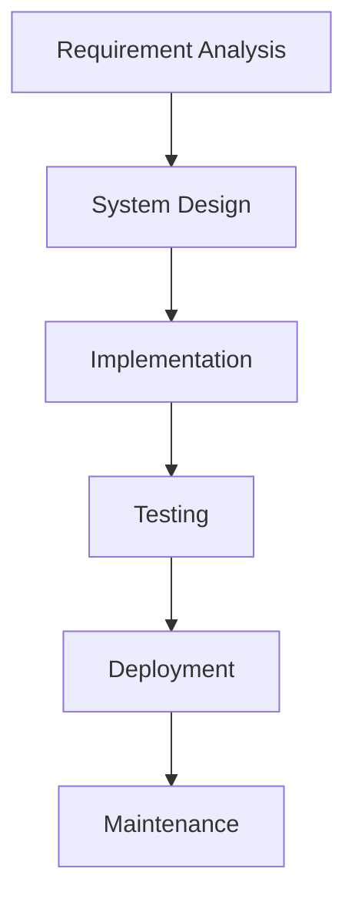

# Waterfall Methodology

## Project Information

**Project Title:** 
Peer-to-Peer Bicycle Rental Platform

**Group Name:** 
Group-D

**Team Members:**
- Dongfang Wang
- Xiaoning Li

## Introduction
The diagram below represents the traditional Waterfall Model used in software development. It follows a sequential approach where each phase must be completed before moving to the next. For this project, the Waterfall methodology is suitable because the Peer-to-Peer Bicycle Rental Platform has a clear set of planned requirements, defined system features, and a structured development workflow.

## Requirement Analysis

In the requirement analysis phase, the main functional and non-functional requirements of the Peer-to-Peer Bicycle Rental Platform are identified. The system must allow users to register, log in, manage profiles, and choose to act as a renter, lender, or both.

The lender requirements include creating bicycle listings, uploading bicycle photos, submitting ownership evidence, setting location, availability, condition, size, type, and rental price. The renter requirements include searching for bicycles by location, type, size, price, condition, and availability, then sending a booking request.

The platform also requires a booking workflow that includes lender approval, handover confirmation, rental status tracking, return confirmation, damage reporting, and basic admin dispute review. The MVP will include simulated deposit calculation instead of real payment integration.

## System Design

In the system design phase, the structure of the platform is planned before coding begins. The system will be divided into a backend, frontend, database, authentication system, file upload process, and deployment environment.

The backend will be developed using Python, Django, and Django REST Framework. It will provide APIs for users, bike listings, bookings, deposits, damage reports, and admin review. The frontend will be developed using React, Vite, Axios, and React Router to provide user interfaces for renters, lenders, and administrators.

PostgreSQL will be used as the database to store user records, bicycle listings, booking data, deposit records, uploaded file references, and dispute information. JWT authentication will be used to manage secure user access. Docker will be used to containerise the backend, frontend, and database during development.

## Implementation

In the implementation phase, the planned system components will be developed according to the design. The backend will include models, serializers, views, API endpoints, authentication logic, and admin functions. The frontend will include pages and components for registration, login, profile management, bicycle listing, search, booking, rental tracking, and dispute handling.

The rule-based recommendation feature will be implemented using filters such as location, bike type, size, price, availability, and condition. The simulated deposit calculation will use the bicycle's original price, age, and condition to calculate an estimated deposit amount.

File upload functionality will be implemented for bicycle photos, ownership receipts, and basic identity documents. The booking workflow will be implemented using clear status changes such as requested, approved, handed over, returned, damage reported, and completed.

## Testing

In the testing phase, the system will be checked to ensure that each feature works correctly and that the full rental workflow can be completed. Backend testing will focus on API endpoints, user authentication, bike listing creation, booking status changes, deposit calculation, and admin dispute decisions.

Frontend testing will check that users can navigate the application, submit forms, search for bicycles, create bookings, and view rental status information. Integration testing will confirm that the React frontend communicates correctly with the Django REST API.

Important test cases will include user registration and login, lender bike listing submission, admin approval, renter search and booking, lender approval or rejection, handover confirmation, return confirmation, damage report submission, and deposit release or partial deduction.

## Deployment

In the deployment phase, the completed platform will be prepared for release. The application can be deployed using Docker Compose with the backend, frontend, PostgreSQL database, and Nginx reverse proxy on a VPS. As an alternative, AWS services such as EC2, RDS, and S3 can be used for hosting, database management, and file storage.

GitHub Actions will be used for CI/CD to automate build, testing, and deployment tasks. This will help ensure that new changes are checked before they are released to the production environment.

## Maintenance

In the maintenance phase, the platform will be monitored and improved after deployment. Bugs found by users will be fixed, and existing features will be refined based on feedback from renters, lenders, and administrators.

Future enhancements may include real online payment, real identity verification, GPS tracking, map API integration, AI-based damage detection, and more advanced dispute handling. These improvements can be added after the MVP has successfully demonstrated the main peer-to-peer bicycle rental workflow.
